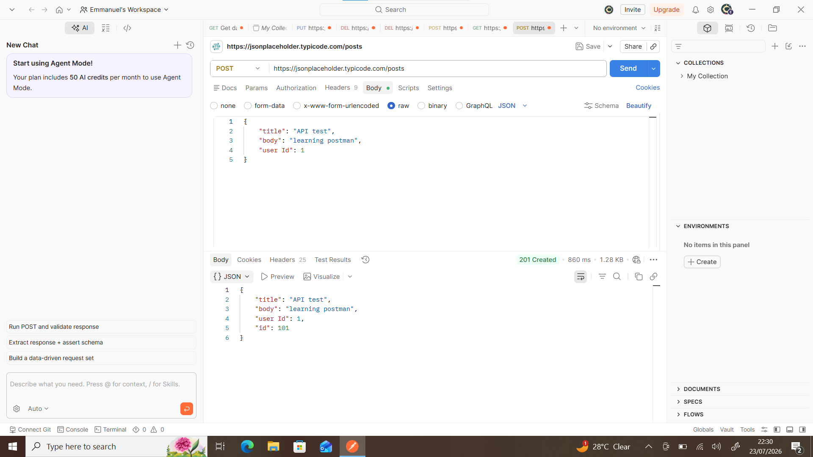
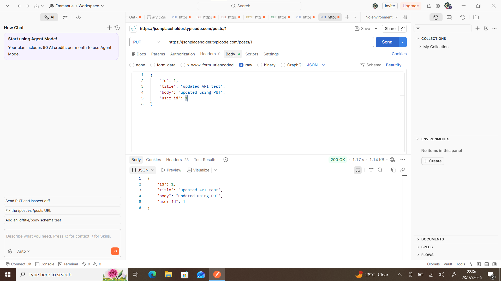
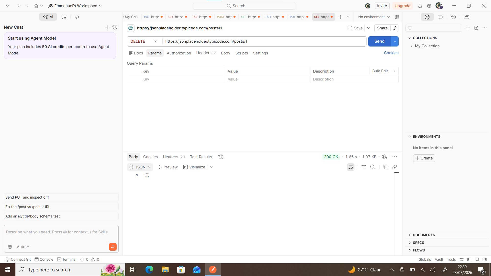

# API Troubleshooting Project

this project document my API learning and troubleshooting practice using postman and git
skills covered:
- HTTP Methods
- HTTP status codes
- JSON
- Postman

## screenshots

### GET Request

### POST Request

### PUT Request

### DELETE Request

